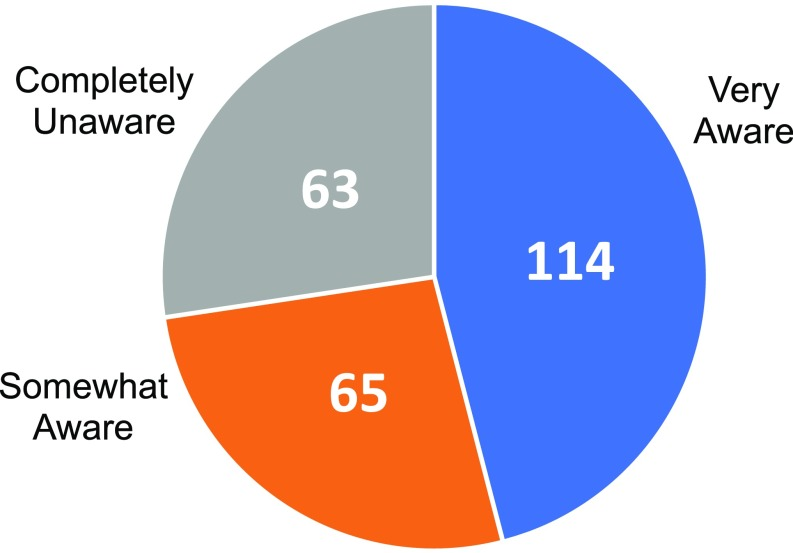

```{r setup, include=FALSE}
knitr::opts_chunk$set(echo = TRUE)
```

An RMarkdown file will allow us to weave markdown text with chunks of R code to be evaluated and output content like tables and plots. The RMarkdown file can be output to different format such as HTML, PDF and Word. Further, we can use LaTeX codes in the RMarkdown file to prepare a professional document.  
<br />
First we demonstrate how to create a simple RMarkdown file with output to HTML format. Next, we will demonstrate how to use LaTeX code in RMarkdown file and output to PDF format.  


# Procedures to create a RMarkdown file  

1. File -> New File -> RMarkdown ... -> Document of output format HTML, click `OK`.
2. A template RMarkdown file is created. There are white and grey sections. R code is in grey sections, and other text is in white.
3. "Knit HTML" by clicking the blue yarn at the top of the RMarkdown file and the HTML document will be created.


# Codes used in the RMarkdown file
*   **R code chunks** are surrounded by 3 backticks and `{r LABEL}`. These code chunks are shown in the document and result of the code chunks will be followed.
*   The R code chunks with the option `echo=FALSE`, such as `{r pressure, echo=FALSE}, the printing of the code chunks will be suppressed and only the result will be shown.
*   The code chunks could be printed without evaluation by enclosing the code beginning with 3 backticks and the type of programme, like ````r`, and ended with 3 backticks.
*   The hashtag (#) cause the following text to be displayed larger and in bold.  

<br />
For RStudio built in reference: Go to Help > Markdown Quick Reference.  
<br />
You can get further reference at http://rmarkdown.rstudio.com/

# Knite to PDF and use LaTeX commands
In order to output document in PDF format, we need to install MikTeX and run a R code. These steps just need to perform once.

1.  Install MikTeX.
2.  Run the following R code:
    ```{r eval=FALSE}
       tinytex::install_tinytex()
    ```

# Some Markdown tricks

**Use `eqnarray` to align the equal sign in a series of equation**

\begin{eqnarray}
{\hat{u}_{i}}^2 &=&(Y_i-\hat{Y}_{i})^2 =(Y_i-\hat{\beta}_{1}-\hat{\beta}_{2}X_i)^2 \\

&=& Y_i^2+\hat{\beta}_{1}^2+\hat{\beta}_{2}^2X_i^2-2\hat{\beta}_{1}Y_i-2\hat{\beta}_{2}X_iY_i+2\hat{\beta}_{1}\hat{\beta}_{2}X_i \\
\end{eqnarray}

(For formatting of the above equation array, see the website [Using R Markdown for Class Reports][Eqnarray] by Cosma Shalizi for more information.)  
<br />

**Use `\quad\mathrm{and}\quad` to join two equations with "and"**

\begin{equation}
\frac{\partial{RSS}}{\partial{\hat{\beta}_{1}}}=0
\quad\mathrm{and}\quad
\frac{\partial{RSS}}{\partial{\hat{\beta}_{2}}}=0
\end{equation}

(Please see the website [https://tex.stackexchange.com/questions/288222/two-equations-in-one-line][2equations] for more information on how to format two equations on one line.)


**Different ways to add "for all" in the equation**


$\underline{Using ~~ \forall ~~ symbol}$
$$E(u_i|X_i,...,X_n)=0~~~ \forall~~ i$$
$$E(u_i)=0 ~~~\forall ~~ i$$
$\underline{Add~ the~ words "for ~all" -~ method ~1}$

$$E(u_i|X_i,...,X_n)=0 ~~~ for~all ~~ i$$
$\underline{Add~ the~ words "for ~all" -~ method ~2}$

\begin{equation}
E(u_i|X_i,...,X_n)=0
\quad\mathrm{for~~all}\quad
i
\end{equation}

**SWEET STYLES**

*italics* or _italics_

**bold**

***bold italics***

__underline__

__*underline italics*__

$\underline{This\space sentence\space underlined\space using\space \LaTeX}$


# R Markdown Syntax: Hyperlinks, Images & Tables

This section is adapted from the article [R Markdown Syntax: Hyperlinks, Images & Tables](https://ucsbcarpentry.github.io/R-markdown/04-links-images-tables/index.html) in the [Authoring scientific publications with R Markdown](https://ucsbcarpentry.github.io/R-markdown/index.html) website.

## Creating Hyperlinks

Hyperlinks are created using the syntax `[text](link)` with no spaces in between the parentheses and the square brackets.

For example:

```{r eval=FALSE}
[RStudio](https://www.rstudio.com)
```

which will give:

[RStudio](https://www.rstudio.com)

## Inserting Images

You can add images to an R Markdown report using markdown syntax as follows: ``

You’ll notice this format is exactly the same as hyperlinks, but with the addition of an `!` before the brackets and parentheses.

> Tip: Paths to Files\
The specification of the list of folders to travel and the file name is called a path. A path that starts at the root folder of the computer is called an <b>absolute path</b>. A <b>relative path</b> starts at a given folder and provides the folders and file starting from that folder. Using relative paths will make a number of things easier. A path is made up of folder names. If the path is to a file, then the path will ends with a file name. The folders and files of a path are separated by a directory separator. There are a few special directory names. A single period `.` indicates the current working directory. Two periods `..` indicates moving up a directory.

However, when you knit the report, RStudio will only be able to find your image if you have placed it in the right place - RELATIVE to your .Rmd file. This is where good file management becomes extremely important. For example, when your .Rmd file is in the working directory `R4DS` and the figure is in the `figs` subfolder of the folder `R4DS`. In that case, make sure your path starts with `./figs/` along with the correct image name and file extension. Also the closing bracket and the opening parentheses should be close to each other, without any spaces in between.


To start let’s identify Fig. 1, which is in the folder `R4DS/figs`. We will insert the image right after that. This image will have the caption labeled “FIGURE 1 (in the folder `R4DS/figs`” (that we will be pasting in the chat). We need that caption to render the image.

The markdown should look like:

```{r eval=FALSE}

```

This will output as:


We now insert another figure, which is in the folder `R4DS`, that is the same as where the .Rmd file is. The markdown code is:

```{r eval=FALSE}

```

<b>Note</b>: A preview of your image should pop up automatically in RStudio if you have the correct relative path. But this will be only true if you type out the code, not if you copy and paste it.

and the output is:


### Resizing Images

The image you just added looks a little too big, right? We can resize it by adjusting the width and height ratio. Let’s say we want this image to be half of the original size. In order to do that, we will have to add to the syntax:


```{r eval=FALSE}
{width=50% height=50%}
```

and the output is:

{width=50% height=50%}


## Inserting table

We can also use markdown syntax to insert a formatted table into our document. The basic syntax to insert a table looks like this:

```{r eval=FALSE}
Column Header | Column Header
---           | ---              
Cell 1        |  Cell 2       
Cell 3        |  Cell 4   
```

Start with the column names/headers. Separate columns with the pipe ( | ) symbol. Right below the column headers use at least three dashes to separate the headers from the cells of the table. Then fill in the contents of the table row by row, separating columns using the pipe ( | ) symbol.

The following is a table example:

```{r eval=FALSE}
**Category** | **N**
:--- | :---:
Poor sample quality from users/sample variability/limited biological material | 51  
Lack of well-trained principle investigators and lab members/Poor oversight | 45  
Poor experimental design: Lack of sufficient replicates/inadequate sample size/lack of adequate controls | 43   
Inadequate standardization of protocols or guidelines, and data analysis | 43   
Cost and time | 39   
Failure to leverage the core’s expertise/following the core’s advice/no consulting beforehand | 23   
Inadequate documentation of experiments/data management | 19   
Instruments: maintenance, upgrades, changes | 15   
Responses that could not be assigned to a category | 11 
```

**Category** | **N**
:--- | :---:
Poor sample quality from users/sample variability/limited biological material | 51  
Lack of well-trained principle investigators and lab members/Poor oversight | 45  
Poor experimental design: Lack of sufficient replicates/inadequate sample size/lack of adequate controls | 43   
Inadequate standardization of protocols or guidelines, and data analysis | 43   
Cost and time | 39   
Failure to leverage the core’s expertise/following the core’s advice/no consulting beforehand | 23   
Inadequate documentation of experiments/data management | 19   
Instruments: maintenance, upgrades, changes | 15   
Responses that could not be assigned to a category | 11  


[Eqnarray]: https://www.stat.cmu.edu/~cshalizi/rmarkdown/
[2equations]: https://tex.stackexchange.com/questions/288222/two-equations-in-one-line

    
 


